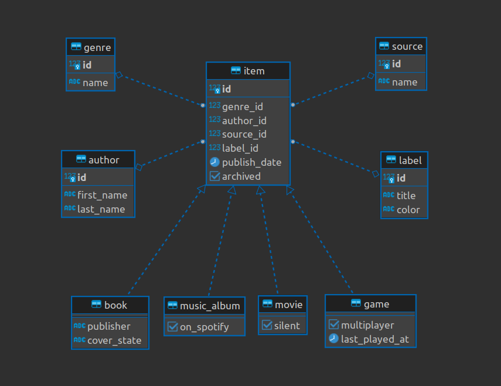

# Ruby Capstone

## Description

In this project, we create a console app that helps you to keep a record of different types of things you won: books, music albums, movies, and games. Everything is based on the UML class diagram presented below. The data is stored in JSON files and we also prepare a database with tables structure analogical to our program's class structure.

## Built With

- Ruby
- PostgreSQL

## Run it

Use the following steps to run this Project locally:

- Create a directory

- Open the terminal

- Run this command:
`git clone git@github.com:emyrue/RubyCapstone.git`

- Enter in to the folder:
`cd RubyCapstone`

- Open the folder with a code editor (VS Code preferred)

## Author

👤 **Juan Sebastian Sotomayor**

- GitHub: [@Juanse7793](https://github.com/Juanse7793)
- Twitter: [@Juanse77930](https://twitter.com/Juanse77930)
- LinkedIn: [Juan Sebastian Sotomayor](https://linkedin.com/in/juansebastiansotomayor)

👤 **Emily Robertson**

- GitHub: [@emyrue](https://github.com/emyrue)
- Twitter: [@EmyrueRobertson](https://twitter.com/EmyrueRobertson)
- LinkedIn: [LinkedIn](https://www.linkedin.com/in/emilyruthrobertson/) 

👤 **George Rios**

- GitHub: [@Alexr16](https://github.com/Alexr16)
- Twitter: [@ReveloJ](https://twitter.com/ReveloJ)
- LinkedIn: [Jorge Ríos](https://www.linkedin.com/in/jorgeriosr/) 

👤 **Isaac Pitwa**

- GitHub: [@isaacpitwa](https://github.com/isaacpitwa)
- Twitter: [@isaacpitwa](https://twitter.com/isaacpitwa)
- LinkedIn: [LinkedIn](https://linkedin.com/in/isaac-pitwa)

## Run Test

- Run this command in your terminal
`gem install rspec`

- Run Rspec tests
`rspec tests`

## 🤝 Contributing

Contributions, issues, and feature requests are welcome!

Feel free to check the [issues page](../../issues/).

## Show your support

Give a ⭐️ if you like this project!

## Acknowledgments

- Hat tip to anyone whose code was used
- Inspiration

## 📝 License

This project is [MIT](./LICENSE) licensed.